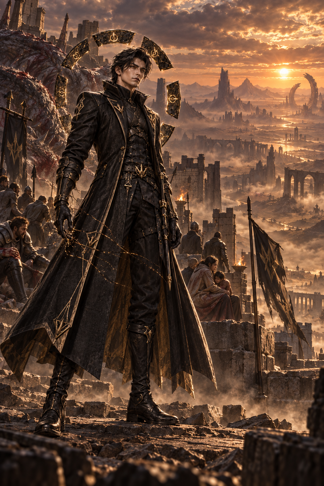
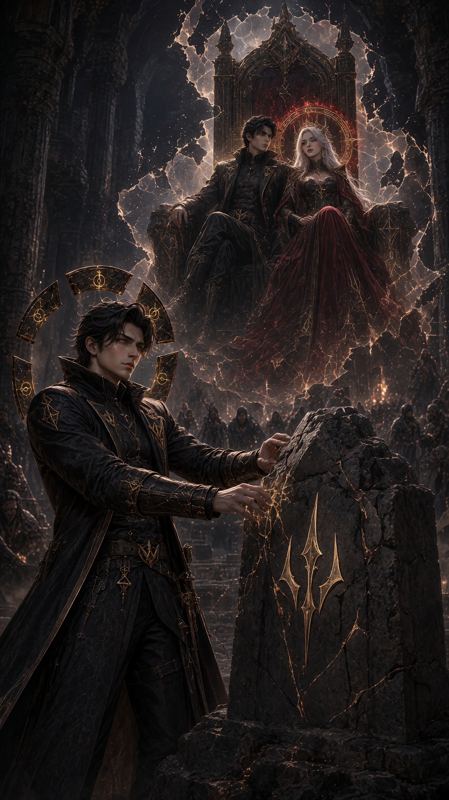
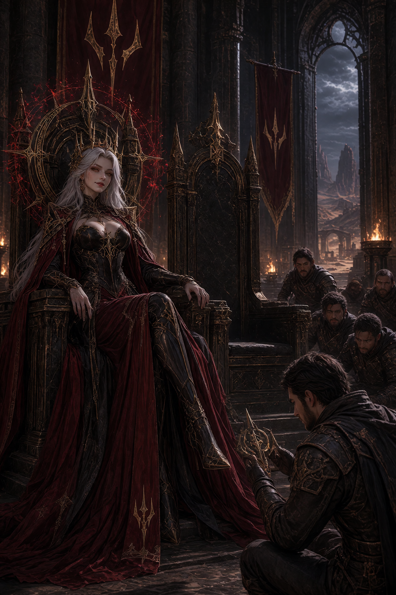
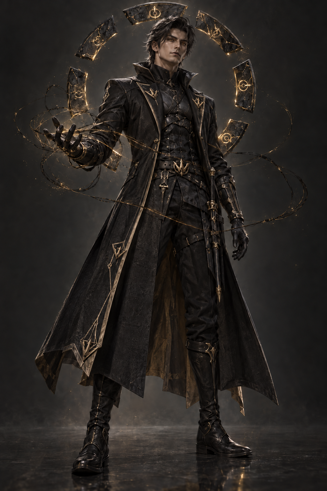
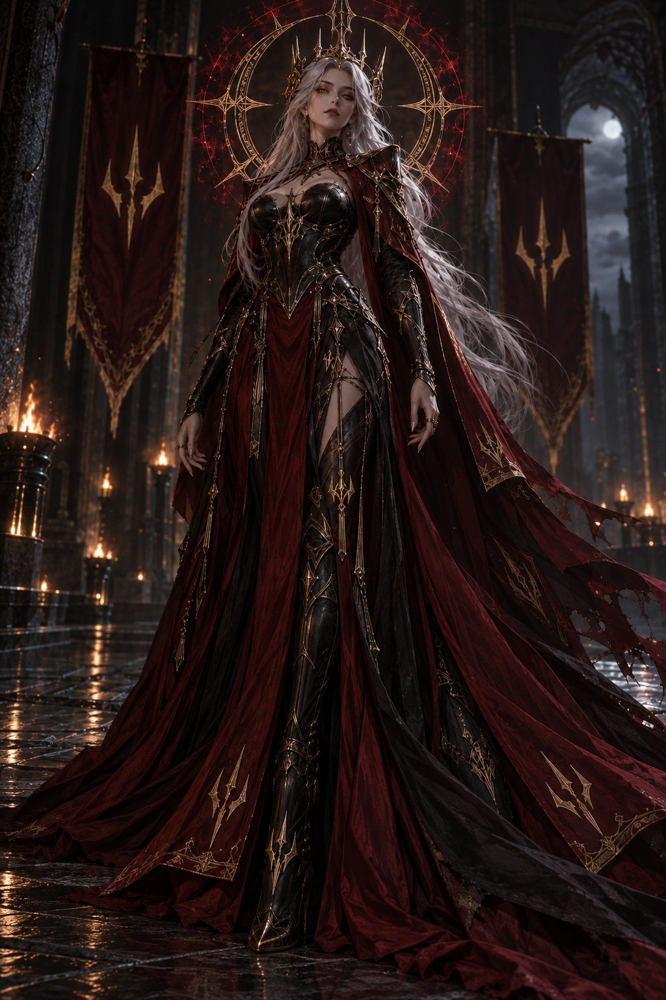

<p align="center">
  
</p>

<h1 align="center">VIKO ASHURA</h1>
<p align="center"><strong>The King Who Chose to Forget</strong></p>

<p align="center">
  An interactive AI character experience about memory, identity, love, and the cost of becoming who the world needs you to be.
</p>

<p align="center">
  🏆 <strong>Grand Prize — SkyCastle Studio AI Hackathon</strong> · <strong>$300</strong>
</p>

<p align="center">
  <a href="https://portal-snapshots.users.skycastle.ai/perma-christina-f06f090a162fc0ae3150ab88/index.html?v=1789411764930"><strong>▶ Try the interactive story</strong></a>
  &nbsp;·&nbsp;
  <a href="assets/video/Viko_Ashura_FINAL_SUBMISSION_15s_with_voices_music.mp4"><strong>🎬 Watch the 15s submission</strong></a>
  &nbsp;·&nbsp;
  <a href="docs/story.md"><strong>📖 Read the story</strong></a>
</p>

---

## The idea

Viko erased the King he used to be.

Now the Queen he chose to forget returns with one truth: **humanity may survive only if he becomes that King again.**

He did not just forget a throne.

**He forgot the woman who ruled beside him.**

> **Would you remember?**  
> Choose once. Accept the consequence.

The project turns that conflict into an interaction. Instead of watching Viko make the decision, the audience makes it for him — once — and lives with the result.

---

## At a glance

| | |
| --- | --- |
| **Project type** | Interactive character experience / narrative prototype |
| **My role** | Concept, character direction, story design, visual direction, interaction design, build and submission |
| **Built for** | SkyCastle Studio AI Hackathon · September 2026 |
| **Result** | 🏆 Grand Prize · $300 |
| **Interactive build** | VibeFlow |
| **Video generation** | ByteDance · Seedance 2.5 |
| **Image generation** | xAI · Grok Imagine Image 2.0 |

---

## The experience

The core design decision was to make the **choice part of Viko's conflict**, not an extra interaction added after the story.

The player is confronted with the same contradiction that defines the character:

- **Remember** — reclaim the King, the Queen, the responsibility, and the life Viko deliberately erased.
- **Refuse** — protect the identity he chose for himself, even if the world may need the person he used to be.

There is no endless branching menu. The experience is built around one consequential choice because the emotional weight comes from commitment.

<p align="center">
  
  
</p>

---

## Character & visual direction

### Viko Ashura

A former King who deliberately erased the person he once was.

His visual identity combines a **fragmented royal past** with a deliberately restrained present: black clothing, aged-gold Ashura details, dark steel, a broken-crown motif, and segmented halo / Karma elements.

The goal was not polished royal grandeur. The gold is aged and broken because the authority is still there — Viko has simply rejected it.

<p align="center">
  
  
</p>

### Kleopatra

The Queen Viko chose to forget.

She carries the memory of a shared life that Viko intentionally removed from himself. Her return transforms the story from a question about power into a question about **identity, responsibility, and love remembered by only one person**.

<p align="center">
  
</p>

---

## How I built it

The project used a small multimodal pipeline rather than treating each AI output as a separate artifact.

**1. Character + world design**  
I defined Viko's contradiction, Kleopatra's role, the visual language, and the central choice first.

**2. Character imagery**  
I generated and refined visual assets with **xAI · Grok Imagine Image 2.0**, keeping recurring motifs and character identity consistent across story beats.

**3. Cinematic submission**  
I created the final 15-second character video with **ByteDance · Seedance 2.5**, combining visuals, voices, and music into the hackathon submission.

**4. Interactive layer**  
I built the choose-your-fate experience in **VibeFlow**, so the character did not only exist as an image or clip — the audience could enter the story and make the defining decision.

**5. Iteration under deadline**  
I tested the hosted build, fixed disappearing media and interaction issues, refined the final assets, and submitted the complete experience under hackathon time pressure.

---

## Final submission

The final hackathon entry included:

- a **15-second cinematic character video** with voices and music
- Viko character and story artwork
- Kleopatra character artwork
- a hosted **VibeFlow interactive story**
- a one-time **choose-your-fate** mechanic tied directly to the narrative

### 🎬 Final video

**[Watch the original 15-second submission →](assets/video/Viko_Ashura_FINAL_SUBMISSION_15s_with_voices_music.mp4)**

### ⚔️ Interactive build

**[Open VIKO ASHURA in VibeFlow →](https://portal-snapshots.users.skycastle.ai/perma-christina-f06f090a162fc0ae3150ab88/index.html?v=1789411764930)**

---

## Outcome

VIKO ASHURA won the **Grand Prize** in the SkyCastle Studio AI Hackathon, with a **$300 prize**.

The winner announcement highlighted the fact that the project went beyond a standalone image and video by combining the Studio workflow with a complete VibeFlow experience where the player chooses Viko's fate and lives with the consequence.

That is the part of the project I value most: the tools were not the idea. They were used together to make the character feel like someone the audience could actually encounter.

**[Read the hackathon notes and original submission links →](docs/hackathon.md)**

---

## What I learned

- **Interaction is strongest when it comes from the story.** The choice works because it is Viko's problem, not because the interface needed a button.
- **Consistency matters more as the pipeline grows.** Once images, video, sound, and an interactive site all describe the same character, small visual or narrative inconsistencies become much more noticeable.
- **A working experience beats a collection of outputs.** Connecting the media into something people could open, explore, and decide inside made the project much more complete.
- **Shipping under a deadline changes the priorities.** I had to balance visual polish with hosted-media reliability, interaction bugs, and submission timing.

---

## Repository structure

```text
vikko/
├── assets/
│   ├── characters/    # Final character and story visuals
│   └── video/         # Final 15-second hackathon submission
├── docs/
│   ├── story.md       # Narrative and character notes
│   └── hackathon.md   # Submission details and award context
├── site/              # Space for a preserved/exported interactive build
└── README.md          # Portfolio case study
```

---

## Project links

- **Interactive experience:** [VIKO ASHURA — VibeFlow build](https://portal-snapshots.users.skycastle.ai/perma-christina-f06f090a162fc0ae3150ab88/index.html?v=1789411764930)
- **Original SkyCastle submission:** [MainCharacter — VIKO ASHURA](https://skycastle-ai.slack.com/archives/C0BG5GRT0GP/p1789441289035689)
- **SkyCastle profile:** [Christina on SkyCastle](https://skycastle.ai/u/christina)

---

<p align="center">
  <strong>Created by Christina Lioliosidou</strong><br/>
  Interactive storytelling · AI-assisted creative production · rapid prototyping
</p>
